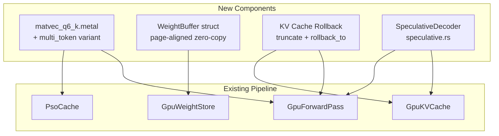

# Design: mistral-7b-perf

## Overview

Four performance optimizations targeting the Mistral-7B Q4_0 decode bottleneck (42 -> 100+ tok/s). Each optimization is independent except speculative decode depending on batch prefill for verification. Architecture extends existing patterns -- new Metal kernels follow matvec_q8_0 template, weight store gains WeightBuffer abstraction, forward pass gains rollback capability.

## Architecture



## Components

### Component 1: Q6_K Metal Matvec Kernel

**Purpose**: Fused dequantize + dot product for Q6_K quantized weights, eliminating F32 dequant at load time.

**Shader Design** (`matvec_q6_k.metal`):

```metal
struct BlockQ6_K {
    uchar ql[128];   // low 4 bits
    uchar qh[64];    // upper 2 bits
    char  scales[16]; // signed int8 sub-block scales
    half  d;          // super-block scale
};

// 256 threads = 8 simdgroups, ROWS_PER_TG=8
// Buffer binding: weight=0, input=1, output=2, out_dim=3, in_dim=4
kernel void matvec_q6_k(...);
```

Inner loop per super-block (256 elements): two 128-element chunks, each with 4 groups of 32 values. Reconstruct 6-bit values from ql+qh, multiply by scale*d, dot product with input via float4 vectorization.

**Multi-token variant** (`multi_token_matvec_q6_k.metal`):
- Adds `batch_size` param at buffer(5)
- Outer loop over tokens, inner loop over blocks (SLC weight cache reuse)
- Follows `multi_token_matvec_q4_0.metal` pattern exactly

**Rust integration** (`gpu_forward_pass.rs`):
- `encode_matvec_q6_k()` method following `encode_matvec_q8_0()` pattern
- `encode_multi_token_matvec_q6_k()` for batched variant
- PSO prewarm: add `PsoKey::simple("matvec_q6_k")` and `PsoKey::simple("multi_token_matvec_q6_k")`

**lm_head dispatch chain** (updated priority):
```
1. Q6_K native  (lm_head_q6k present)   -- NEW
2. Q8_0 native  (lm_head_q8 present)    -- existing
3. F32 matvec   (lm_head_is_f32)        -- existing
4. Q4_0 matvec  (default)               -- existing
```

### Component 2: WeightBuffer (Page-Aligned Zero-Copy)

**Purpose**: Enable `newBufferWithBytesNoCopy` for non-page-aligned GGUF tensors by rounding down to page boundary and tracking offset.

```rust
pub struct WeightBuffer {
    pub buffer: Retained<ProtocolObject<dyn MTLBuffer>>,
    /// Byte offset from buffer start to actual tensor data.
    pub offset: usize,
}
```

**Allocation strategy**:
```rust
fn make_weight_buffer_aligned(device, data, name, page_size, mmap_end) -> WeightBuffer {
    let ptr = data.as_ptr() as usize;
    let page_start = ptr & !(page_size - 1);  // round down
    let offset = ptr - page_start;
    let aligned_len = (offset + data.len() + page_size - 1) & !(page_size - 1);

    // Safety check: don't read past mmap boundary
    if page_start + aligned_len <= mmap_end {
        if let Some(buf) = create_weight_buffer(device, page_start as *mut _, aligned_len) {
            return WeightBuffer { buffer: buf, offset };
        }
    }

    // Fallback: copy-based
    WeightBuffer { buffer: alloc_buffer_with_data(device, data), offset: 0 }
}
```

**Propagation**: All `set_buffer()` calls in encode methods pass `weight.offset` as the buffer offset parameter. This is already supported by the Metal API.

### Component 3: GQA Batch Prefill

**Purpose**: Make `forward_prompt()` work correctly for Mistral-7B dimensions (32Q/8KV heads, head_dim=128, hidden=4096, ffn=14336).

**Analysis**: The existing `forward_prompt()` is already parameterized for GQA:
- `q_dim = num_heads * head_dim` (4096 for Mistral)
- `kv_dim = num_kv_heads * head_dim` (1024 for Mistral)
- `decode_attention_v2` handles GQA head mapping (`kv_head = head_idx / (num_heads / num_kv_heads)`)

**Changes needed**:
1. Add Q6_K lm_head dispatch path in `forward_prompt()` (FR-7)
2. Add `multi_token_matvec_q6_k` dispatch for batched lm_head
3. Verify `rope_apply` works with head_dim=128 (2048 Q pairs, 512 K pairs)
4. Verify batch buffer allocation scales for Mistral dimensions

### Component 4: Speculative Decoding Scaffolding

**Purpose**: `SpeculativeDecoder` struct wrapping two `GpuForwardPass` instances (draft + target) with accept/reject loop.

```rust
pub struct SpeculativeDecoder {
    draft: GpuForwardPass,
    target: GpuForwardPass,
    n_draft: usize,
}

impl SpeculativeDecoder {
    pub fn new(draft_path: &Path, target_path: &Path, n_draft: usize) -> Result<Self, String>;
    pub fn generate<F>(&mut self, prompt: &[u32], max_tokens: usize, cb: F) -> Vec<u32>
        where F: FnMut(u32) -> bool;
    pub fn reset(&mut self);
}
```

**KV Cache Rollback**:
```rust
impl GpuKVCache {
    pub fn truncate(&mut self, new_len: usize) {
        assert!(new_len <= self.len);
        self.len = new_len;  // O(1), stale data never read
    }
}

impl GpuForwardPass {
    pub fn rollback_to(&mut self, position: usize) {
        self.position = position;
        self.kv_caches.truncate_all(position);
    }
}
```

**Speculation round**:
1. Draft model: N=8 `forward_token()` calls -> draft_tokens + draft_logits
2. Target model: `forward_prompt_logits(draft_tokens)` -> target_logits for all N positions
3. Accept/reject: greedy comparison (temp=0): accept if argmax(target) == draft_token
4. Rollback both models to accept point
5. If all accepted: bonus token from target's last logits

**`forward_prompt_logits()`**: New method returning `Vec<Vec<f32>>` (one logit vector per input position). Uses batched multi_token_matvec for lm_head to compute all logits in one dispatch.

## Data Flow

1. Q6_K kernel: GGUF Q6_K bytes -> BlockQ6_K struct -> fused dequant + dot product -> F32 output row
2. Page alignment: GGUF mmap ptr -> round down to page -> zero-copy MTLBuffer + offset -> dispatch with offset
3. Batch prefill: N tokens -> batched matvec through all layers -> per-token attention with GQA -> logits for last token
4. Speculative: draft 8 tokens -> batch verify all 8 through target -> accept/reject -> yield accepted tokens

## Technical Decisions

| Decision | Options | Choice | Rationale |
|----------|---------|--------|-----------|
| Q6_K threading | 32 threads, 256 threads | 256 (8 SG, 8 rows/TG) | Matches Q8_0 pattern; proven for large output dims (32000 vocab) |
| Page alignment | Copy to aligned alloc, page-offset wrapper, GGUF repack | Page-offset wrapper | Zero runtime overhead; no GGUF modification |
| Spec decode draft count | N=4, N=8, adaptive | N=8 fixed | SmolLM is fast; higher N means bigger verification batches |
| Verification method | Per-token forward, batched forward_prompt_logits | Batched | Single command buffer; weight-cache reuse for all N tokens |
| KV rollback | Full reset + replay, truncate len | Truncate len | O(1); stale data never read (kv_len gates access) |
| Sampling in spec decode | Greedy only, full sampling | Greedy (temp=0) | Mathematically guaranteed correct; sampling deferred |

## File Structure

| File | Action | Purpose |
|------|--------|---------|
| `crates/metal-attention-kernels/shaders/matvec_q6_k.metal` | Create | Q6_K single-token matvec kernel |
| `crates/metal-attention-kernels/shaders/multi_token_matvec_q6_k.metal` | Create | Q6_K batched matvec for prefill/verify |
| `crates/metal-attention/src/gpu_weight_store.rs` | Modify | WeightBuffer struct, lm_head_q6k field, page-aligned alloc |
| `crates/metal-attention/src/gpu_forward_pass.rs` | Modify | encode_matvec_q6_k, Q6_K PSO, lm_head dispatch, rollback_to, forward_prompt_logits |
| `crates/metal-attention/src/gpu_kv_cache.rs` | Modify | truncate() method |
| `crates/metal-attention/src/speculative.rs` | Create | SpeculativeDecoder struct and generation loop |
| `crates/metal-attention/src/lib.rs` | Modify | pub mod speculative |
| `crates/metal-attention/src/sampling.rs` | Modify | Make softmax pub(crate), add sample_from_probs |
| `crates/metal-attention/src/inference.rs` | Modify | --draft and --draft-tokens CLI flags |
| `crates/metal-attention/tests/gpu_correctness.rs` | Modify | Add Q6_K, page-align, batch prefill GQA tests |
| `crates/metal-attention/tests/speculative_correctness.rs` | Create | Speculative decode correctness tests |
| `crates/metal-attention/benches/inference.rs` | Modify | Add Q6_K, prefill, speculative benchmarks |

## Error Handling

| Error | Handling | User Impact |
|-------|----------|-------------|
| Q6_K PSO compile failure | Panic at prewarm (startup) | Immediate error with clear message |
| Page alignment OOB (past mmap end) | Fall back to copy-based alloc | No visible impact, log warning |
| Draft/target vocab mismatch | Return Err from SpeculativeDecoder::new() | User must use compatible model pair |
| KV cache overflow during draft | Stop drafting early, verify partial batch | Transparent, fewer draft tokens |
| All draft tokens rejected | Yield 1 corrected token per round | Worst case: target-only speed |
| forward_prompt_logits OOM | Reduce n_draft or fail with message | Error with suggestion |

## Existing Patterns to Follow

- `matvec_q8_0.metal` (lines 1-71): exact template for Q6_K kernel structure, threading, buffer binding
- `multi_token_matvec_q4_0.metal` (lines 1-85): template for batched Q6_K variant
- `make_weight_buffer()` in `gpu_weight_store.rs` (lines 97-128): extend with page-offset logic
- lm_head dispatch chain in `forward_token()` (lines 493-520): add Q6_K slot at top
- `encode_matvec_q8_0()` pattern in `gpu_forward_pass.rs`: template for Q6_K encode method
- PSO prewarm list (lines 272-299): add new kernel keys
- `forward_prompt()` (line 545): already GQA-parameterized, extend lm_head dispatch only
