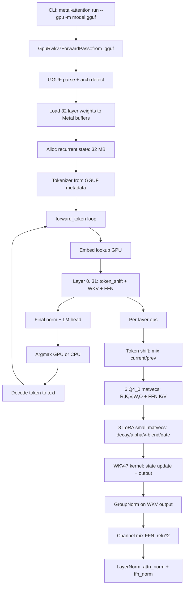

# Design: rwkv7-inference

## Overview
Separate GPU inference path (GpuRwkv7ForwardPass) for RWKV-7 7.2B on Apple Silicon. New file gpu_rwkv7_forward_pass.rs implements GGUF loading, recurrent state management, WKV-7 kernel dispatch, and decode loop. Reuses existing Q4_0 matvec, RMSNorm, embedding kernels. Extends GGUF architectures.rs with 30+ RWKV-7 tensor mappings. Upgrades existing simplified WKV kernel to full recurrence incrementally.

## Architecture



## Components

### Component A: GpuRwkv7ForwardPass
**Purpose**: Main GPU inference engine for RWKV-7. Owns weights, recurrent state, scratch buffers.

**Responsibilities**:
- Load GGUF model via GpuWeightStoreRwkv7 (new struct, similar to existing GpuWeightStore)
- Allocate recurrent state buffers (32 MB: 32 layers x 64 heads x 64 x 64 x 4 bytes)
- Dispatch embedding lookup kernel
- Per-layer forward pass: token shift → matvecs → LoRA → WKV → GroupNorm → FFN
- Final norm + LM head → logits
- Greedy argmax (reuse existing GPU argmax or CPU fallback)

**File**: `crates/metal-attention/src/gpu_rwkv7_forward_pass.rs` (~600 lines)

**Key methods**:
```rust
pub fn from_gguf(path: &Path) -> Result<Self, String>
pub fn forward_token(&mut self, token_id: u32) -> Result<Vec<f32>, String>  // returns logits
pub fn forward_token_greedy(&mut self, token_id: u32) -> Result<u32, String>  // returns next token
fn forward_layer(&mut self, layer_idx: usize, hidden: &MTLBuffer, state: &mut Rwkv7State) -> Result<(), String>
```

### Component B: GpuWeightStoreRwkv7
**Purpose**: Zero-copy Metal buffers for RWKV-7 weights. Extends GGUF tensor mapping.

**Responsibilities**:
- Map 30+ RWKV-7 tensor suffixes in architectures.rs (time_mix_lerp_fused, time_mix_w0/w1/w2, etc.)
- Load per-layer buffers: attn_norm, ffn_norm, time_mix_ln (GroupNorm), channel_mix_lerp_k, LoRA tensors
- Load shared buffers: token_embd.weight (Q8_0), token_embd_norm, output_norm, output.weight
- Reuse create_weight_buffer() for zero-copy Q4_0/Q8_0 tensors

**File**: Extend `crates/metal-attention/src/gpu_weight_store.rs` with Rwkv7WeightStore struct (~200 lines)

**Struct**:
```rust
pub struct Rwkv7WeightStore {
    // Per-layer (32 x each)
    time_mix_lerp_fused: Vec<Retained<ProtocolObject<dyn MTLBuffer>>>,  // [6, 4096]
    time_mix_w0/w1/w2: Vec<...>,  // decay LoRA
    time_mix_a0/a1/a2: Vec<...>,  // alpha LoRA
    time_mix_v0/v1/v2: Vec<...>,  // v-blend LoRA
    time_mix_g1/g2: Vec<...>,     // gate LoRA
    time_mix_k_k/k_a/r_k: Vec<...>,  // scalars
    time_mix_ln_weight/bias: Vec<...>,  // GroupNorm
    channel_mix_lerp_k: Vec<...>,
    channel_mix_key/value: Vec<...>,  // Q4_0 FFN projections
    attn_norm/ffn_norm: Vec<...>,  // RMSNorm weights

    // Shared (1 x each)
    token_embd: Retained<...>,  // Q8_0 [65536, 4096]
    token_embd_norm: Retained<...>,
    output_norm: Retained<...>,
    output: Retained<...>,  // Q4_0 [65536, 4096]

    _gguf: Arc<GgufFile>,
}
```

### Component C: GGUF Tensor Mapping Extension
**Purpose**: Map RWKV-7 tensor naming conventions to WeightRole enum.

**Responsibilities**:
- Extend map_rwkv_suffix() in architectures.rs with 30+ new cases
- Handle fused tensors (time_mix_lerp_fused → 6 x [4096] slices)
- Handle LoRA tensors (w0, w1, w2 triplets)
- Handle GroupNorm (time_mix_ln.weight + time_mix_ln.bias)

**File**: `crates/metal-attention-gguf/src/architectures.rs` (extend existing ~315 lines)

**New WeightRole variants**:
```rust
pub enum WeightRole {
    // ... existing ...
    // RWKV-7 specific (add to existing enum)
    TimeMixLerpFused,  // [6, 4096] fused x_r, x_w, x_k, x_v, x_a, x_g
    TimeMixW0, TimeMixW1, TimeMixW2,  // decay LoRA
    TimeMixA0, TimeMixA1, TimeMixA2,  // alpha LoRA
    TimeMixV0, TimeMixV1, TimeMixV2,  // v-blend LoRA
    TimeMixG1, TimeMixG2,  // gate LoRA (no G0)
    TimeMixKK, TimeMixKA, TimeMixRK,  // scalars
    TimeMixLnWeight, TimeMixLnBias,  // GroupNorm
    ChannelMixLerpK,
    TokenEmbdNorm, OutputNorm,
}
```

### Component D: WKV-7 Kernel (Upgraded)
**Purpose**: Full RWKV-7 recurrence with delta rule, data-dependent decay, GroupNorm.

**Responsibilities**:
- Compute data-dependent decay: w = exp(-0.606531 * sigmoid(w0 + tanh(xw @ w1) @ w2))
- Compute in-context learning rate: a = sigmoid(a0 + (xa @ a1) @ a2)
- Delta rule self-modification: ab = (-kk)^T @ (kk * a)
- Full state update: state = diag(w)*state + state@ab + v^T*k
- GroupNorm: normalize output by groups
- Bonus attention: r*k term
- Gated output: sigmoid(g) * (output @ O)

**File**: `crates/metal-attention-kernels/shaders/rwkv_wkv_v7.metal` (~300 lines, new)

**Kernel signature**:
```metal
kernel void rwkv_wkv_v7(
    device const float* r [[buffer(0)]],
    device const float* k [[buffer(1)]],
    device const float* v [[buffer(2)]],
    device const float* w0 [[buffer(3)]],  // decay LoRA base
    device const float* w1 [[buffer(4)]],  // decay LoRA down (4096 -> 64)
    device const float* w2 [[buffer(5)]],  // decay LoRA up (64 -> 4096)
    // ... 15+ more buffers for a0/a1/a2, kk, ka, rk, group_norm_w, group_norm_b, g, o_proj ...
    device float* state_io [[buffer(20)]],
    device float* output [[buffer(21)]],
    constant WkvParams& params [[buffer(22)]],
    ...
)
```

**Dispatch**: `dispatch_rwkv_wkv_v7()` in `crates/metal-attention-kernels/src/rwkv.rs` (~100 lines)

### Component E: GroupNorm Kernel
**Purpose**: Group normalization for WKV output (64 groups, 64 channels/group).

**Responsibilities**:
- Split [4096] into 64 groups of 64 elements
- Per-group: mean, variance, normalize
- Apply weight + bias

**File**: `crates/metal-attention-kernels/shaders/group_norm.metal` (~80 lines, new)

**Reuse option**: Adapt RMSNorm kernel with grouping + bias support.

### Component F: LoRA Small Matvec Kernel
**Purpose**: Optimized matvec for low-rank projections (4096 -> 32-128 -> 4096).

**Responsibilities**:
- Two-stage matvec: x @ w1 (4096 -> rank), result @ w2 (rank -> 4096)
- Add base vector: output = base + (x @ w1) @ w2

**File**: `crates/metal-attention-kernels/shaders/lora_matvec.metal` (~100 lines, new)

**Reuse option**: Call existing Q4_0 matvec twice (if LoRA weights are Q4_0) or matvec_f32 (if F32).

### Component G: Channel Mix FFN Kernel
**Purpose**: RWKV-7 channel mix with squared ReLU activation.

**Responsibilities**:
- Token shift: k_input = x + (x_prev - x) * lerp_k
- k = relu(k_input @ K_weight)^2
- output = k @ V_weight

**File**: Extend `crates/metal-attention-kernels/shaders/ffn.metal` with squared ReLU variant (~50 lines)

**Reuse**: Existing dispatch_ffn_silu can be adapted (replace silu with relu^2).

## Data Flow

1. **Model loading**:
   - GgufFile::open() → mmap model file
   - detect_architecture() → ModelArchitecture::Rwkv
   - GpuWeightStoreRwkv7::from_gguf() → load 32 layers + shared weights to Metal buffers
   - Alloc recurrent state: 32 x [num_heads * head_dim * head_dim] + prev_token [hidden_size]

2. **Single token forward (decode)**:
   - Embedding lookup: token_id → [hidden_size] on GPU
   - token_embd_norm (RMSNorm)
   - For layer 0..31:
     - Token shift: current ← mix * current + (1 - mix) * prev_token
     - 6 Q4_0 matvecs (R, K, V, W, O_pre, FFN K/V): [hidden_size] → [hidden_size]
     - 8 LoRA small matvecs (decay/alpha/v-blend/gate): [hidden_size] → [rank] → [hidden_size]
     - WKV-7 kernel: (r, k, v, w, state, LoRA params) → (output, state_new)
     - GroupNorm on WKV output
     - Channel mix FFN: (hidden, prev_hidden) → hidden_ffn
     - attn_norm + ffn_norm (RMSNorm)
     - Update prev_token ← current
   - output_norm (RMSNorm)
   - LM head Q4_0 matvec: [hidden_size] → [vocab_size]
   - Argmax or sampling: logits → next_token

3. **Autoregressive decode loop**:
   - Tokenizer: prompt → token_ids
   - Prefill: for token in token_ids: forward_token(token)  # warm up state
   - Decode: for i in 0..max_tokens: next = forward_token_greedy(next); emit(next)
   - Tokenizer: token_id → text
   - Stop on EOS or max_tokens

## Technical Decisions

| Decision | Options | Choice | Rationale |
|----------|---------|--------|-----------|
| Separate vs extend GpuForwardPass | (1) New gpu_rwkv7_forward_pass.rs, (2) Extend existing | (1) New file | RWKV-7 has recurrent state (not KV cache), different op sequence, different kernels. Separate file avoids polluting transformer logic. |
| WKV kernel upgrade strategy | (1) Monolithic v7 kernel, (2) Incremental stages | (2) Incremental | Start with simplified WKV (working), add delta rule, then LoRA, then GroupNorm. Easier to debug. |
| GroupNorm kernel | (1) New kernel, (2) Adapt RMSNorm | (2) Adapt RMSNorm | RMSNorm already has per-row reduction logic. Add grouping + bias. Saves kernel dev time. |
| LoRA matvec kernel | (1) New specialized, (2) Reuse Q4_0 matvec | (2) Reuse Q4_0 matvec | LoRA weights likely Q4_0 in GGUF. Call existing matvec twice: x @ w1, result @ w2. |
| State management | (1) GPU-side persistent, (2) CPU-side copy | (1) GPU-side | 32 MB state stays on GPU. Only updated per token, no CPU transfer. Matches transformer KV cache pattern. |
| Quantization | (1) Q4_0 only, (2) Mixed Q4_0/Q8_0/F32 | (2) Mixed | Embeddings Q8_0 (256 MB → 65 MB), large matvecs Q4_0, norms/LoRA F32. Matches existing GpuWeightStore pattern. |
| Tokenizer | (1) BPE from GGUF, (2) External file | (1) BPE from GGUF | RWKV tokenizer embedded in GGUF metadata. Existing GgufTokenizer supports this. |
| Argmax | (1) GPU-side, (2) CPU-side | (1) GPU-side | Existing argmax kernel (argmax.metal) in codebase. Reuse for greedy decode. Avoids 256 MB logits readback. |

## File Structure

| File | Action | Purpose |
|------|--------|---------|
| crates/metal-attention/src/gpu_rwkv7_forward_pass.rs | Create | GpuRwkv7ForwardPass struct + from_gguf + forward_token |
| crates/metal-attention/src/gpu_weight_store.rs | Modify | Add Rwkv7WeightStore struct (~200 lines) |
| crates/metal-attention-gguf/src/architectures.rs | Modify | Extend map_rwkv_suffix with 30+ tensor mappings |
| crates/metal-attention-kernels/shaders/rwkv_wkv_v7.metal | Create | Full WKV-7 kernel with delta rule + LoRA |
| crates/metal-attention-kernels/shaders/group_norm.metal | Create | GroupNorm kernel (or adapt rmsnorm.metal) |
| crates/metal-attention-kernels/shaders/lora_matvec.metal | Create | Low-rank matvec (or reuse matvec_q4_0.metal) |
| crates/metal-attention-kernels/shaders/ffn.metal | Modify | Add squared ReLU variant for channel mix |
| crates/metal-attention-kernels/src/rwkv.rs | Modify | Add dispatch_rwkv_wkv_v7() |
| crates/metal-attention-kernels/src/lib.rs | Modify | Export new dispatch functions |
| src/main.rs | Modify | Add RWKV-7 branch to run_inference_gpu() |

## Error Handling

| Error | Handling | User Impact |
|-------|----------|-------------|
| GGUF not RWKV architecture | Err("Unsupported architecture") | Clear error: "Model is not RWKV-7" |
| Missing RWKV-7 tensor | Err("Missing tensor: blk.0.time_mix_w1.weight") | Points to specific missing weight |
| State buffer allocation fails | Err("Failed to allocate 32 MB state buffer") | OOM error |
| WKV kernel dispatch fails | Err("WKV kernel failed: {status}") | Metal error status |
| Tokenizer missing from GGUF | Err("No tokenizer in GGUF metadata") | Suggests model re-export with tokenizer |
| EOS not reached in max_tokens | Warn, return partial output | Generation completes, warns truncation |

## Existing Patterns to Follow

**From GpuForwardPass** (gpu_forward_pass.rs:116-179):
- from_gguf() pattern: open GGUF → extract metadata → build weight store → alloc buffers → prewarm PSOs
- Scratch buffer allocation: `alloc_buffer_private()` for ping-pong hidden states
- Command buffer + encoder pattern: single encoder for all dispatches per token
- waitUntilCompleted() only after full forward pass (not per kernel)

**From GpuWeightStore** (gpu_weight_store.rs:50-69):
- Keep Arc<GgufFile> alive while zero-copy buffers reference mmap
- create_weight_buffer() for Q4_0/Q8_0 tensors (zero-copy when aligned)
- alloc_buffer_with_data() for F32 norms (always copy)
- Per-layer Vec<AttnProjBuffers> / Vec<FfnBuffers> structure

**From Q4_0 matvec dispatch** (matvec_q4_0.rs):
- Function constant for M (number of rows)
- PsoKey with function constants cached
- Threadgroup size: `(M * N).min(1024)`
- Single dispatch call, no loop

**From main.rs run_inference_gpu()** (main.rs:659-793):
- Load GGUF, extract tokenizer, drop GGUF before building GPU pass (separate mmaps)
- Prefill loop: for tok in prompt_tokens: forward_token(tok)
- Decode loop: for i in 0..max_tokens: next = forward_token_greedy(next)
- Timing: prefill_start/decode_start, measure separately
